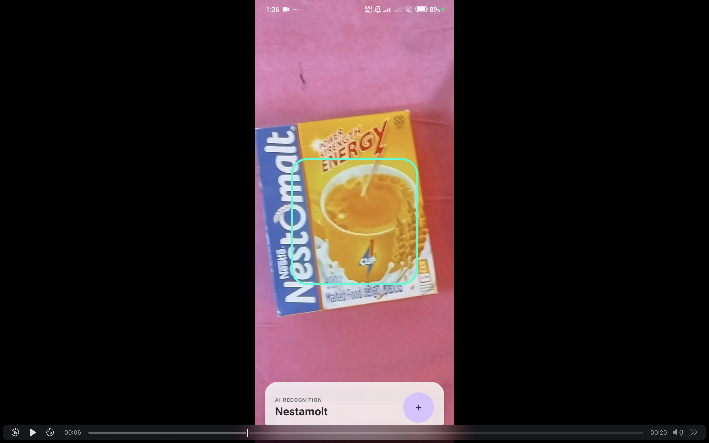
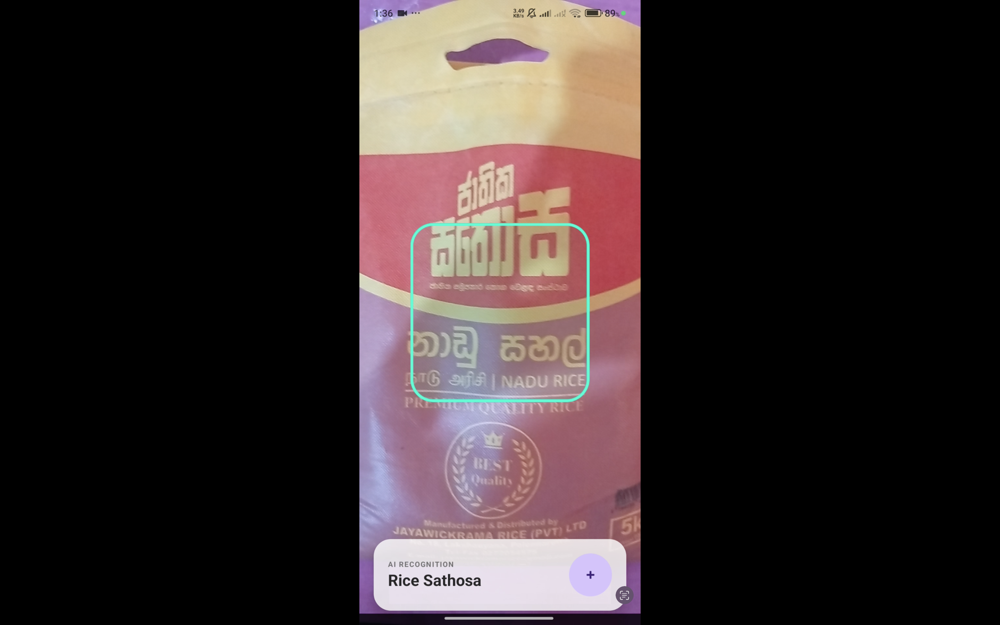
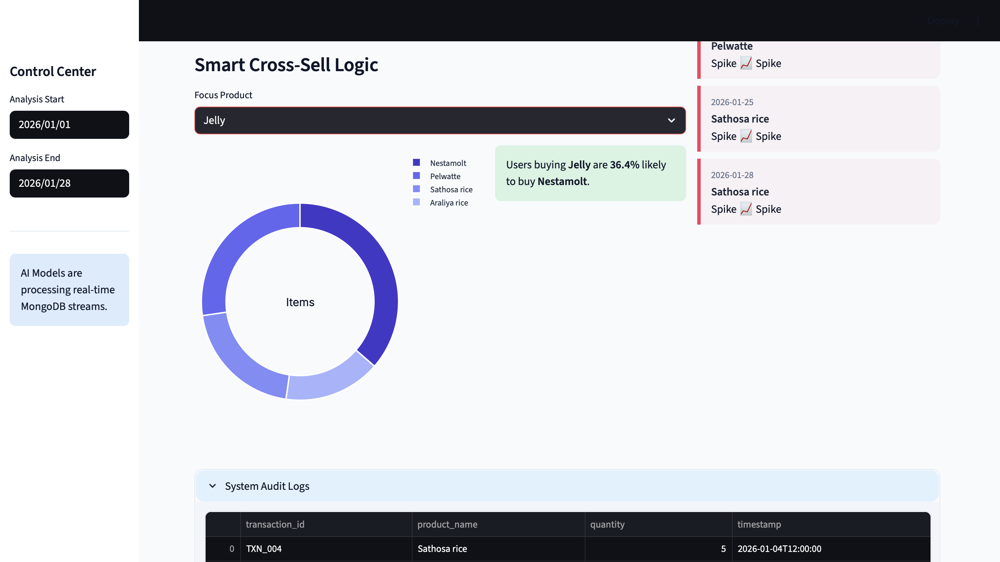
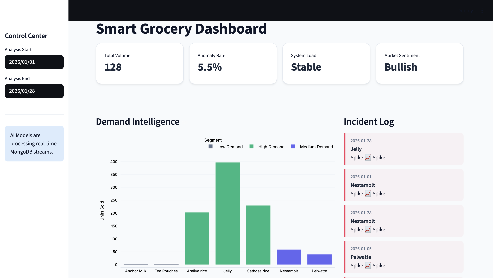

#  Sri Lankan Grocery Classifier & Smart Inventory System

A full-stack AI solution designed to identify Sri Lankan grocery items in real-time, automate billing via a mobile app, and provide data-driven business insights through an analytics dashboard.

---

##  Project Overview
This project bridges the gap between retail and AI by combining computer vision with data analytics.
1.  **Custom Dataset:** Hand-captured photos of local brands specific to the Sri Lankan market.
2.  **Computer Vision:** A MobileNetV2 model trained to identify 5 specific grocery classes.
3.  **Mobile Edge AI:** Real-time classification on Android using **TensorFlow Lite**.
4.  **Big Data & Analytics:** Transaction data storage in **MongoDB** and a **FastAPI** dashboard for business intelligence.

---

##  The Dataset
Since specialized datasets for Sri Lankan products are rare, a custom dataset was created from scratch by capturing and labeling images of locally available grocery items.
* **Total Classes:** 5
* **Labels:** `Jelly`, `Nestomalt`, `Pelwatte Milk Powder`, `Araliya Rice`, `Sathosa Rice`.
* **Augmentation:** Applied rotation, zoom, and brightness shifts to improve model robustness.

> **Dataset Link:** [Insert your Kaggle or Google Drive link here]
>


---

##  Machine Learning Pipeline
The model utilizes **Transfer Learning** with **MobileNetV2** for high performance on mobile devices.

### Model Architecture:
* **Base:** MobileNetV2 (Pre-trained on ImageNet).
* **Custom Head:** Global Average Pooling -> Dropout (0.3) -> Dense (128, ReLU) -> Softmax Output.
* **Optimization:** Keras Tuner was used to find the best hyperparameters (Learning Rate, Dropout).


### Performance:
* Trained for 15 epochs with Class Weights to handle potential data imbalance.
* Converted to `.tflite` format for mobile optimization.

---

##  Mobile Application (Android)
Built with **Kotlin** and **Jetpack Compose**, the app serves as a portable POS system.

* **Real-time Analysis:** Uses **CameraX** and **TFLite** for sub-100ms inference.
* **Batch Billing:** Users can scan multiple items, confirm them, and upload the entire transaction to MongoDB.
* **Edge Computing:** No internet is required for the actual product identification.





---

##  Analytics Dashboard (Backend)
The backend is powered by **FastAPI** and **Pandas**, turning raw transaction logs into actionable insights.

### Key Features:
| Feature | Algorithm | Purpose |
| :--- | :--- | :--- |
| **Recommendations** | **Apriori** | Suggests products based on "Frequently Bought Together" patterns. |
| **Product Clustering** | **K-Means** | Groups products into "High Demand", "Medium", and "Low" segments. |
| **Anomaly Detection** | **IQR Method** | Alerts the manager of unusual sales spikes 📈 or drops 📉. |






---

## 🛠️ Installation & Setup

### 1. Training the Model
```bash
# Install dependencies
pip install tensorflow scikit-learn keras-tuner numpy

# Run training script
python train_model.py
